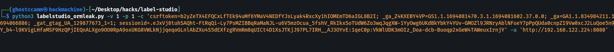

# CVE-2023-47117: Object Relational Mapper Leak Vulnerability in Filtering Task
# Introduction

This write-up describes the technical details for [CVE-2023-47117](https://github.com/HumanSignal/label-studio/security/advisories/GHSA-6hjj-gq77-j4qw) vulnerability that was found in [Label Studio](https://github.com/HumanSignal/label-studio), a popular open source data labeling tool. The vulnerability was found to affect versions before `1.9.2.post0`, where a patch was introduced.

# Overview

In all current versions of [Label Studio](https://github.com/HumanSignal/label-studio), the application allows users to insecurely set filters for filtering tasks. An attacker can construct a *filter chain* to filter tasks based on sensitive fields for all user accounts on the platform by exploiting Django's Object Relational Mapper (ORM). Since the results of query can be manipulated by the ORM filter, an attacker can leak these sensitive fields character by character. For an example, the following filter chain will task results by the password hash of an account on Label Studio.

```
filter:tasks:updated_by__active_organization__active_users__password
```

For consistency, this type of vulnerability will be termed as **ORM Leak** in the rest of this disclosure. 

In addition, Label Studio had a hard coded secret key that an attacker can use to forge a session token of any user by exploiting this ORM Leak vulnerability to leak account password hashes ([`CVE-2023-43791`](https://github.com/HumanSignal/label-studio/security/advisories/GHSA-f475-x83m-rx5m)).

# Description

The following code snippet from the `ViewSetSerializer` in [`label_studio/data_manager/serializers.py`](https://github.com/HumanSignal/label-studio/blob/1.8.2/label_studio/data_manager/serializers.py#L115) insecurely creates `Filter` objects from a JSON `POST` request to the `/api/dm/views/{viewId}` API endpoint.

```python
    @staticmethod
    def _create_filters(filter_group, filters_data):
        filter_index = 0
        for filter_data in filters_data:
            filter_data["index"] = filter_index
            filter_group.filters.add(Filter.objects.create(**filter_data))
            filter_index += 1
```

These `Filter` objects are then applied in the `TaskQuerySet` in [`label_studio/data_manager/managers.py`](https://github.com/HumanSignal/label-studio/blob/1.8.2/label_studio/data_manager/managers.py#L473).

```python
class TaskQuerySet(models.QuerySet):
    def prepared(self, prepare_params=None):
        """ Apply filters, ordering and selected items to queryset

        :param prepare_params: prepare params with project, filters, orderings, etc
        :return: ordered and filtered queryset
        """
        from projects.models import Project

        queryset = self

        if prepare_params is None:
            return queryset

        project = Project.objects.get(pk=prepare_params.project)
        request = prepare_params.request
        queryset = apply_filters(queryset, prepare_params.filters, project, request) <1>
        queryset = apply_ordering(queryset, prepare_params.ordering, project, request, view_data=prepare_params.data)

        if not prepare_params.selectedItems:
            return queryset

        # included selected items
        if prepare_params.selectedItems.all is False and prepare_params.selectedItems.included:
            queryset = queryset.filter(id__in=prepare_params.selectedItems.included)

        # excluded selected items
        elif prepare_params.selectedItems.all is True and prepare_params.selectedItems.excluded:
            queryset = queryset.exclude(id__in=prepare_params.selectedItems.excluded)

        return queryset
```
1. User provided filters are insecurely applied here by calling the `apply_filters` that constructs the Django ORM filter.

The `PreparedTaskManager` in [`label_studio/data_manager/managers.py`](https://github.com/HumanSignal/label-studio/blob/1.8.2/label_studio/data_manager/managers.py#L655) uses the vulnerable `TaskQuerySet` for building the Django queryset for querying `Task` objects, as shown in the following code snippet.

```python
class PreparedTaskManager(models.Manager):
    #...

    def get_queryset(self, fields_for_evaluation=None, prepare_params=None, all_fields=False): <1>
        """
        :param fields_for_evaluation: list of annotated fields in task
        :param prepare_params: filters, ordering, selected items
        :param all_fields: evaluate all fields for task
        :param request: request for user extraction
        :return: task queryset with annotated fields
        """
        queryset = self.only_filtered(prepare_params=prepare_params)
        return self.annotate_queryset(
            queryset,
            fields_for_evaluation=fields_for_evaluation,
            all_fields=all_fields,
            request=prepare_params.request
        )

    def only_filtered(self, prepare_params=None):
        request = prepare_params.request
        queryset = TaskQuerySet(self.model).filter(project=prepare_params.project) <1>
        fields_for_filter_ordering = get_fields_for_filter_ordering(prepare_params)
        queryset = self.annotate_queryset(queryset, fields_for_evaluation=fields_for_filter_ordering, request=request)
        return queryset.prepared(prepare_params=prepare_params)
```
1. Special Django method for the `models.Manager` class that is used to retrieve the queryset for querying objects of a model.
2. Uses the vulnerable `TaskQuerySet` that was explained above.

The following code snippet of the `Task` model in [`label_studio/tasks/models.py`](https://github.com/HumanSignal/label-studio/blob/1.8.2/label_studio/tasks/models.py#L49C1-L102C102) shows that the vulnerable `PreparedTaskManager` is set as a class variable, along with the `updated_by` relational mapping to a Django user that will be exploited as the entrypoint of the filter chain.

```python
# ...
class Task(TaskMixin, models.Model):
    """ Business tasks from project
    """
    id = models.AutoField(auto_created=True, primary_key=True, serialize=False, verbose_name='ID', db_index=True)

    # ...

    updated_by = models.ForeignKey(settings.AUTH_USER_MODEL, related_name='updated_tasks',
        on_delete=models.SET_NULL, null=True, verbose_name=_('updated by'),
        help_text='Last annotator or reviewer who updated this task') <1>

    # ...

    objects = TaskManager()  # task manager by default
    prepared = PreparedTaskManager()  # task manager with filters, ordering, etc for data_manager app <2>

    # ...
```
1. The entry point of the filter chain to filter by the `updated_by__active_organization__active_users__password`.
2. The vulnerable `PreparedTaskManager` being set that will be exploited.

Finally, the `TaskListAPI` view set in [`label_studio/tasks/api.py`](https://github.com/HumanSignal/label-studio/blob/1.8.2/label_studio/tasks/api.py#L205) with the `/api/tasks` API endpoint uses the vulnerable `PreparedTaskManager` to filter `Task` objects.

```python
    def get_queryset(self):
        task_id = self.request.parser_context['kwargs'].get('pk')
        task = generics.get_object_or_404(Task, pk=task_id)
        review = bool_from_request(self.request.GET, 'review', False)
        selected = {"all": False, "included": [self.kwargs.get("pk")]}
        if review:
            kwargs = {
                'fields_for_evaluation': ['annotators', 'reviewed']
            }
        else:
            kwargs = {'all_fields': True}
        project = self.request.query_params.get('project') or self.request.data.get('project')
        if not project:
            project = task.project.id
        return self.prefetch(
            Task.prepared.get_queryset(
                prepare_params=PrepareParams(project=project, selectedItems=selected, request=self.request),
                **kwargs
            )) <1>
```
1. Uses the vulnerable `PreparedTaskManager` to filter objects.

# Proof of Concept

Below are the steps to exploit about how to exploit this vulnerability to leak the password hash of an account on Label Studio.

1. Create two accounts on Label Studio and choose one account to be the victim and the other the hacker account that you will use.
2. Create a new project or use an existing project, then add a task to the project. Update the task with the hacker account to cause the entry point of the filter chain.
3. Navigate to the task view for the project and add any filter with the `Network` inspect tab open on the browser. Look for a `PATCH` request to `/api/dm/views/{view_id}?interaction=filter&project={project_id}` and save the `view_id` and `project_id` for the next step.
4. Download the attached proof of concept exploit script named [`labelstudio_ormleak.py`](./poc/labelstudio_ormleak.py). This script will leak the password hash of the victim account character by character. Run the following command to run the exploit script, replacing the `{view_id}`, `{project_id}`, `{cookie_str}` and `{url}` with the corresponding values. For further explanation run `python3 labelstudio_ormleak.py --help`.

```bash
python3 labelstudio_ormleak.py -v {view_id} -p {project_id} -c '{cookie_str}' -u '{url}'
```

The following example GIF demonstrates exploiting this ORM Leak vulnerability to retrieve the password hash `pbkdf2_sha256$260000$KKeew1othBwMKk2QudmEgb$ALiopdBpWMwMDD628xeE1Ie7YSsKxdXdvWfo/PvVXvw=`.



# Impact

This vulnerability can be exploited to completely compromise the confidentiality of highly sensitive account information, such as account password hashes. For all versions `<=1.8.1`, this finding can also be chained with hard coded `SECRET_KEY` to forge session tokens of any user on Label Studio and could be abuse to deteriorate the integrity and availability.

# Discovered
- August 2023, Alex Brown, elttam
