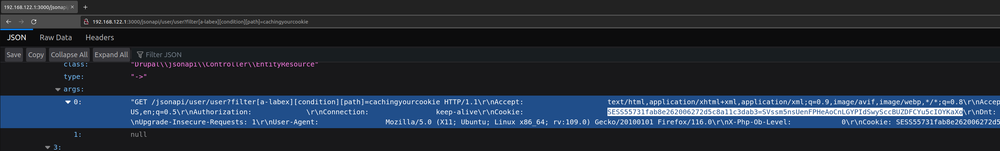

# Introduction

This write-up describes the technical details of `CVE-2023-5256`, a cache poisoning vulnerability that was found in [Drupal core](https://www.drupal.org/project/drupal/releases). The vulnerability affected all Drupal versions `<=10.1.3` and `<=9.5.10` that had the `JSON:API` module enabled.

# Overview

The Drupal `JSON:API` module within the Drupal Core module had a cache poisoning vulnerability that could be exploited in a social engineering attack by a malicious actor to steal a Drupal super administrator's session cookies.

This cache poisoning vulnerability was introduced into the `JSON:API` by a [feature that cached all 4xx responses](https://www.drupal.org/project/drupal/issues/2765959) to improve performance that was [released in Drupal version 8.5.0](https://www.drupal.org/project/drupal/releases/8.5.0).

However, Drupal administrator users are automatically assigned the `access site reports` permission. The `JSON:API` module returns a verbose error message if a user had the `access site reports` permission that shows the request sent by the administrator user along with the administrator's session cookie. This verbose error message would inadvertently cache the administrator's session cookie and any anonymous user could steal the session cookie by visiting the same `JSON:API` endpoint after the administrator if the error message was shown. In addition, an attacker could craft a malicious link that would trigger the verbose error message when visited by an administrator user.


# Description

The following code snippet shows that if the user has the `access site reports` permission, then `$exception->getTrace()` is called.

[`modules/jsonapi/src/Normalizer/HttpExceptionNormalizer.php`](https://github.com/drupal/core/blob/10.1.3/modules/jsonapi/src/Normalizer/HttpExceptionNormalizer.php#L85-L94)
```php
  /**
   * Builds the normalized JSON:API error objects for the response.
   *
   * @param \Symfony\Component\HttpKernel\Exception\HttpException $exception
   *   The Exception.
   *
   * @return array
   *   The error objects to include in the response.
   */
  protected function buildErrorObjects(HttpException $exception) {
    $error = [];
    $status_code = $exception->getStatusCode();
    if (!empty(Response::$statusTexts[$status_code])) {
      $error['title'] = Response::$statusTexts[$status_code];
    }
    $error += [
      'status' => (string) $status_code,
      'detail' => $exception->getMessage(),
    ];
    $error['links']['via']['href'] = \Drupal::request()->getUri();
    // Provide an "info" link by default: if the exception carries a single
    // "Link" header, use that, otherwise fall back to the HTTP spec section
    // covering the exception's status code.
    $headers = $exception->getHeaders();
    if (isset($headers['Link']) && !is_array($headers['Link'])) {
      $error['links']['info']['href'] = $headers['Link'];
    }
    elseif ($info_url = $this->getInfoUrl($status_code)) {
      $error['links']['info']['href'] = $info_url;
    }
    // Exceptions thrown without an explicitly defined code get assigned zero by
    // default. Since this is no helpful information, omit it.
    if ($exception->getCode() !== 0) {
      $error['code'] = (string) $exception->getCode();
    }
    if ($this->currentUser->hasPermission('access site reports')) {
      // The following information may contain sensitive information. Only show
      // it to authorized users.
      $error['source'] = [
        'file' => $exception->getFile(),
        'line' => $exception->getLine(),
      ];
      $error['meta'] = [
        'exception' => (string) $exception,
        'trace' => $exception->getTrace(),
      ];
    }

    return [$error];
  }
```

The PHP `Exception::getTrace` method returns a full stack trace, that included method arguments that included the contents of the of the request sent by the administrator user.

# Proof of Concept

Craft a `JSON:API` URL that causes a `400` response by putting in bad values for inputs. For an example, the following URL will trigger a `400` response.

```
/jsonapi/user/user?filter[a-labex][condition][path]=cachingyourcookie
```

Login with a Drupal administrator account visit the crafted URL. Then as an unauthenticated user, visit the same URL after the administrator user to steal their session cookie. The following screenshot demonstrates stealing an administrator's session cookie as an unauthenticated user.



# Impact

This vulnerability could be utilised in a social engineering attack against a Drupal administrator user to steal their session and gain administrator access to their website. As a Drupal administrator an attacker could completely breach the confidentiality, integrity and availability of the website.

# Discovered
- August 2023, Alex Brown, elttam